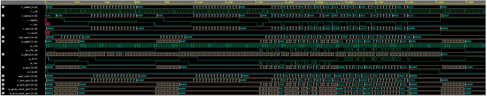

# Asynchronous FIFO Verification (SystemVerilog)

##  Overview

This repository contains a **SystemVerilog-based verification environment** for an **asynchronous FIFO** design. The project demonstrates transaction-level testbench development, including stimulus generation, scoreboard-based checking, functional coverage, and DUT integration.

The environment validates FIFO behavior under different conditions such as:

* Directed fill and drain
* Randomized writes and reads
* Reset scenarios
* Full/empty boundary conditions

---

## Project Structure

* **FIFO DUT**
  Implements a parameterized asynchronous FIFO with dual clock domains, full/empty detection, and pointer handling.

* **Testbench Components**

  * `transaction` – Defines data items and constraints
  * `generator` – Produces randomized/directed transactions
  * `driver` – Drives transactions into the DUT interface
  * `scoreboard` – Compares expected vs. actual data, ensuring FIFO correctness
  * `coverage` – Tracks functional coverage for writes, reads, reset behavior, and FIFO states
  * `environment` – Connects generator, driver, scoreboard, and coverage components
  * `tb` – Top-level testbench that instantiates the DUT and applies clock/reset

---

## Key Features

* Transaction-based stimulus
* Self-checking testbench with scoreboard
* Functional coverage collection
* Multiple test phases: directed, random, and reset
* Parameterizable FIFO depth and width

---

## How to Run

### Run on EDA Playground

Try it online without setup:
[Run on EDA Playground](https://edaplayground.com/x/R3bU)

---

## Verification Strategy

1. **Directed fill-and-drain** – ensures FIFO can correctly store and retrieve data.
2. **Randomized stress testing** – validates FIFO under random write/read operations.
3. **Reset sequence tests** – verifies FIFO behavior when reset is asserted and released.

---

## Coverage Metrics

The environment tracks coverage for:

* Reset behavior
* Write/read operations
* Full and empty conditions
* Transition behavior across FIFO states

---

## Example Waveform

Below is a sample simulation waveform showing FIFO **writes, reads, reset behavior, and full/empty flags**:

---

## References

* Standard asynchronous FIFO design concepts
* UVM-style testbench architecture principles

---

## Author

Developed by **Edwin Dsouza** as part of learning **SystemVerilog verification methodologies**.